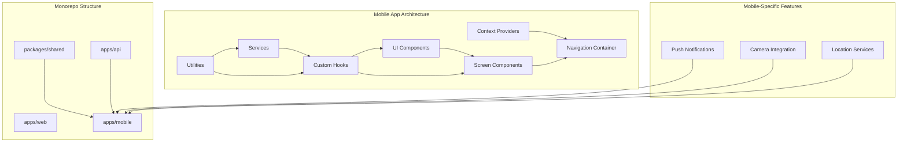
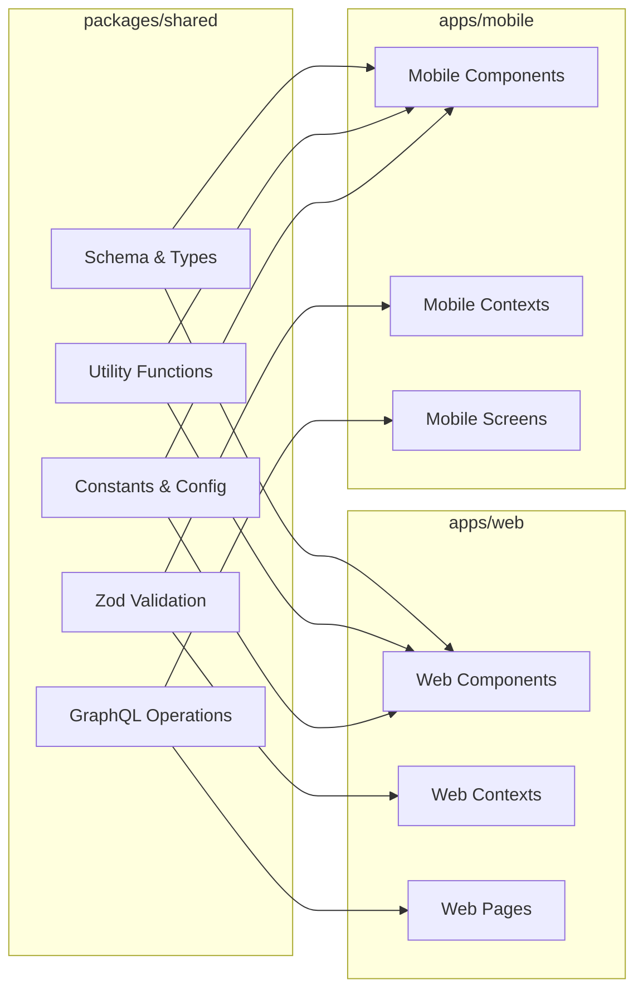
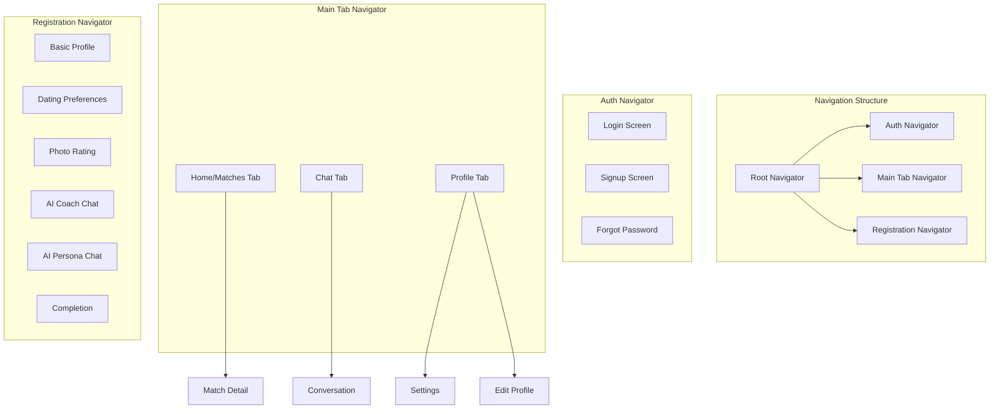

# Entwine Mobile App Interface Plan

**Version:** 1.0
**Date:** 2025-04-11

## 1. Mobile App Architecture

The Entwine mobile app will follow a similar architecture to the web app but optimized for mobile devices. It will be built using React Native with React Native Paper for UI components, and will support both iOS and Android platforms simultaneously.



## 2. Shared Components between Web and Mobile

### 2.1 Code Sharing Strategy

We'll maximize code sharing between web and mobile apps through the `packages/shared` directory:

- **Data Models & Types**: All data models, TypeScript interfaces, and Zod validation schemas
- **API Integration**: GraphQL queries, mutations, and fragments
- **Business Logic**: Core algorithms, utilities, and helper functions
- **Constants**: Configuration values, theme constants, and app-wide settings



### 2.2 Shared Context Structure

The mobile app will implement similar context providers to the web app:

- **AuthContext**: Handle authentication, token management, and user state
- **SocketContext**: Manage real-time communication with Socket.IO
- **ThemeContext**: Provide consistent theming across the app

## 3. Mobile-Specific UI/UX Considerations

### 3.1 UI Component Strategy

We'll use React Native Paper for UI components, which provides Material Design components that work well across both iOS and Android. The UI will maintain the purple-themed design of the web app while optimizing for mobile interaction patterns.

### 3.2 Responsive Design Approach

- **Screen Size Adaptation**: Use Flexbox and relative units for responsive layouts
- **Device Orientation**: Support both portrait and landscape orientations
- **Platform Adaptations**: Adjust UI elements for platform-specific conventions
- **Safe Area Handling**: Respect device notches, home indicators, and system bars

### 3.3 Mobile-Specific Features

- **Push Notifications**: Implement for match alerts, messages, and system notifications
- **Camera Integration**: Native camera access for profile photo uploads
- **Location Services**: Geolocation for distance-based matching
- **Gesture Navigation**: Swipe gestures for card-based interfaces (matching)
- **Haptic Feedback**: Subtle vibrations for important actions and confirmations

## 4. Navigation Structure

The mobile app will use a combination of bottom tab navigation for primary features and stack navigation for detailed flows.



### 4.1 Screen Mapping

| Web Route | Mobile Screen | Navigator |
|-----------|---------------|-----------|
| `/login` | `LoginScreen` | Auth Navigator |
| `/signup` | `SignupScreen` | Auth Navigator |
| `/register` (Step 1) | `BasicProfileScreen` | Registration Navigator |
| `/register` (Step 2) | `DatingPreferencesScreen` | Registration Navigator |
| `/register` (Step 3) | `PhotoRatingScreen` | Registration Navigator |
| `/register` (Step 4) | `AICoachChatScreen` | Registration Navigator |
| `/register` (Step 5) | `AIPersonaChatScreen` | Registration Navigator |
| `/register` (Step 6) | `RegistrationCompleteScreen` | Registration Navigator |
| `/` (Dashboard) | `HomeScreen` | Main Tab Navigator |
| `/chat/:id` | `ConversationScreen` | Stack from Chat Tab |
| `/profile` | `ProfileScreen` | Profile Tab |
| `/settings` | `SettingsScreen` | Stack from Profile Tab |

## 5. Implementation Roadmap

### 5.1 Phase 1: Project Setup and Core Infrastructure

1. Initialize React Native project in `apps/mobile`
2. Configure TypeScript, ESLint, and Prettier
3. Set up React Native Paper and theming
4. Implement navigation structure
5. Create shared context providers (Auth, Socket, Theme)
6. Configure Apollo Client for GraphQL

### 5.2 Phase 2: Authentication and Registration Flow

1. Implement Login and Signup screens
2. Create Registration flow screens (Steps 1-6)
3. Implement form validation and API integration
4. Add camera integration for profile photos
5. Implement location services for user location

### 5.3 Phase 3: Main App Features

1. Develop Home/Matches tab with card-based UI
2. Implement Chat tab and conversation screens
3. Create Profile tab with settings and editing capabilities
4. Add real-time messaging with Socket.IO
5. Implement push notification handling

### 5.4 Phase 4: Mobile-Specific Enhancements

1. Add gesture-based interactions
2. Implement haptic feedback
3. Optimize performance for low-end devices
4. Add deep linking support
5. Implement app state management for background/foreground transitions

### 5.5 Phase 5: Testing and Refinement

1. Conduct cross-platform testing (iOS and Android)
2. Perform usability testing
3. Optimize bundle size and load times
4. Address platform-specific issues
5. Prepare for app store submission

## 6. Platform-Specific Considerations

### 6.1 iOS Specific

- Configure proper permissions for camera and location
- Implement Apple Push Notification Service (APNS)
- Ensure UI follows iOS design guidelines
- Handle iOS-specific gestures and interactions

### 6.2 Android Specific

- Configure proper permissions for camera and location
- Implement Firebase Cloud Messaging (FCM)
- Ensure UI follows Material Design guidelines
- Handle Android-specific back button behavior

## 7. Folder Structure

```
apps/mobile/
├── src/
│   ├── assets/              # Images, fonts, etc.
│   ├── components/          # Reusable UI components
│   │   ├── common/          # Shared components
│   │   ├── auth/            # Auth-related components
│   │   ├── registration/    # Registration components
│   │   ├── home/            # Home/Matches components
│   │   ├── chat/            # Chat components
│   │   └── profile/         # Profile components
│   ├── contexts/            # Context providers
│   │   ├── AuthContext.tsx  # Authentication context
│   │   ├── SocketContext.tsx # Socket.IO context
│   │   └── ThemeContext.tsx # Theming context
│   ├── hooks/               # Custom hooks
│   ├── navigation/          # Navigation configuration
│   │   ├── AuthNavigator.tsx
│   │   ├── MainNavigator.tsx
│   │   ├── RegistrationNavigator.tsx
│   │   └── RootNavigator.tsx
│   ├── screens/             # Screen components
│   │   ├── auth/            # Auth screens
│   │   ├── registration/    # Registration screens
│   │   ├── home/            # Home/Matches screens
│   │   ├── chat/            # Chat screens
│   │   └── profile/         # Profile screens
│   ├── services/            # API and other services
│   │   ├── api/             # API integration
│   │   ├── push/            # Push notification handling
│   │   └── location/        # Location services
│   ├── theme/               # Theming configuration
│   └── utils/               # Utility functions
├── App.tsx                  # Root component
└── index.js                 # Entry point
```

## 8. Key Technical Decisions

1. **Navigation Library**: React Navigation for comprehensive navigation management
2. **UI Component Library**: React Native Paper for Material Design components
3. **State Management**: Context API for global state, local state for component-specific state
4. **API Integration**: Apollo Client for GraphQL, same as web app
5. **Real-time Communication**: Socket.IO Client for React Native
6. **Form Handling**: React Hook Form with Zod validation
7. **Image Handling**: React Native Image Picker for camera/gallery access
8. **Location Services**: React Native Geolocation for location tracking
9. **Push Notifications**: React Native Firebase for FCM (Android) and APNS (iOS)
10. **Styling Approach**: Styled components with React Native Paper theming